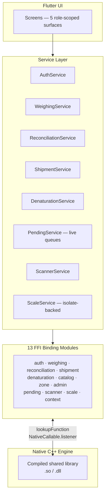
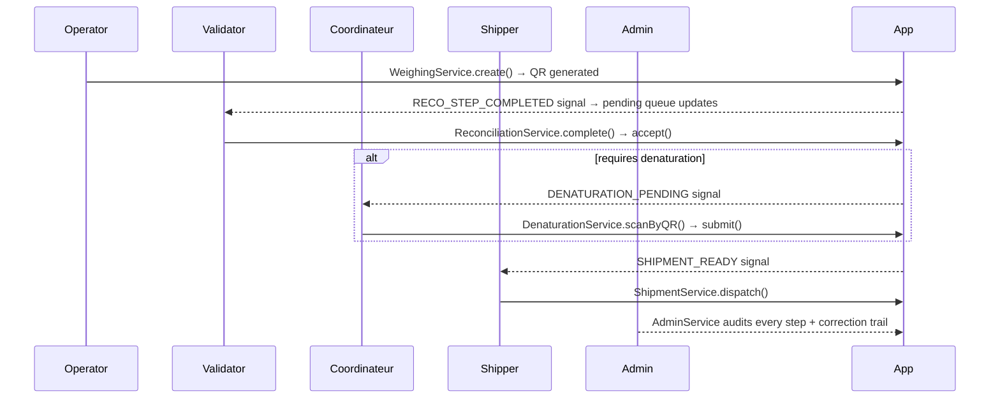

# Waste Tracking — Flutter Desktop Client

**The Flutter desktop application that drives a real-time, audit-compliant industrial waste-tracking system — talking directly to a native C++ engine through a hand-rolled Dart FFI layer, with zero HTTP in between.**

[](#)
[](#)
[](#)
[](#)
[](#license)

> The companion client to [`waste-tracking-ffi-core`](#) — this repo is everything the operator, validator, coordinateur, shipper, and admin actually touch: screens, state, and the 13-module FFI binding layer that speaks to the native engine.

---

## Why this project exists

Most Flutter apps call a REST API and render JSON. This one **owns memory across a language boundary.**

Every string that crosses from C++ into Dart is either *owning* (must be freed) or *non-owning* (must never be freed) — and getting that backwards means a memory leak or a crashed native process, not a stack trace with a nice red squiggle. There's no HTTP layer, no serializer doing the safety net work for you. The Dart FFI binding layer **is** the contract.

This isn't a CRUD demo — it drives real weighing hardware, real QR scanners, and a live multi-role factory floor workflow, under a compliance model where **nothing is ever silently overwritten.** Every correction is logged, flagged, and reviewable.

---

## Architecture



### The "service per domain" pattern

Every business domain (auth, weighing, reconciliation, denaturation, shipment, catalog, zone, admin, pending) gets its **own service singleton** that owns exactly one thing: translating typed Dart calls into FFI calls, and native signal callbacks into typed Dart streams. No service reaches into another's session state — they all read the single active `UserSession` from `AuthService`.

| Layer | Responsibility |
|---|---|
| **Screens** | Role-scoped UI — an Operator never sees the Admin's widget tree, driven by server-issued capability strings, not a hardcoded switch |
| **Services** | One singleton per domain; owns native signal wiring, exposes typed `Future`/`Stream` APIs, never touches `dart:ffi` types directly |
| **Bindings** | 13 modules, each wrapping one native chamber's `extern "C"` surface — manual `malloc`/`free`, `NativeCallable` lifecycle, and string-ownership rules documented per function |
| **Models** | Normalize every JSON response shape a given endpoint has ever returned into one clean, immutable Dart type |
| **Engine** | Owns the single native library handle and the root `WasteTrackingHandle` every binding operates against |

---

## Design patterns worth reading the code for

**1. Manual ownership, explicitly documented**
Every binding file opens with a contract comment (`context_get_error` → non-owning, never free · `context_free_string` → call for every other heap string). The rule isn't tribal knowledge — it's written at the top of the file it applies to.

**2. Liberal JSON parsing, strict internal types**
Endpoints evolved multiple response shapes over the project's life — `weights.net` vs `original.net` vs a flat `weight` field, depending on which one you hit. Rather than let that leak into the UI, models like `PendingItem.fromJson` and `Shipment.fromJson` absorb every known shape in one place, so the rest of the app only ever sees one clean, stable type.

**3. Isolate-backed hardware I/O**
The scale reader runs on a dedicated `Isolate`, streaming live and stable weight events back over a `ReceivePort` — continuous serial polling never blocks the UI thread, even while a screen is mid-render.

**4. One scanner, three typed streams**
A single QR scanner bridge fans out into `recoScans`, `shipmentScans`, and `denatScans` — whichever workflow is "active" claims the incoming scan. One piece of hardware, no cross-workflow leakage.

**5. Fail loud, not quiet**
The `Weighing` model throws on a malformed or missing field instead of defaulting to `0.0`. For an audit-critical record, silence is the bug.

---

## Workflow



---

## Tech stack

- **Flutter** — cross-platform desktop UI
- **Dart FFI** (`dart:ffi`) — direct native interop, no HTTP layer
- **`dart:isolate`** — non-blocking hardware I/O for the scale reader
- **`NativeCallable`** — bidirectional native ↔ Dart signal callbacks
- **C++ engine** — see [`waste-tracking-ffi-core`](#) for the native side of this contract

---

## Getting started

```bash
git clone https://github.com/<your-username>/<repo-name>.git
cd <repo-name>

flutter pub get
flutter run
```

> Requires the compiled native engine library (`libwaste_engine.so` / `waste_engine.dll`) available on the load path — see `engine.dart` for the platform-specific lookup.

---

## Project structure

```
.
├── bindings/                  # 13 FFI modules — one per native chamber
│   ├── auth.dart
│   ├── weighing.dart
│   ├── reconciliation.dart
│   ├── shipment.dart
│   ├── denat.dart
│   ├── catalog.dart
│   ├── zone.dart
│   ├── admin.dart
│   ├── pending.dart
│   ├── scanner.dart
│   ├── scale.dart
│   ├── context.dart
│   └── types.dart              # Shared handles, structs, enums
├── models/                     # Immutable, JSON-shape-normalizing Dart types
├── services/                   # One singleton per business domain
├── screens/                    # Role-scoped UI surfaces
│   ├── admin/
│   ├── shared/
│   └── ...
├── widgets/                     # Reusable UI components
└── engine.dart                  # Native library load + root handle
```

---

## About the developer

Built by **Mohamed Amine** — Bachelor's in Computer Science (Computer Systems) from the University of Blida 1, currently pursuing a Master's in Artificial Intelligence. Background in C++ and systems-level engineering.

- [LinkedIn](https://www.linkedin.com/in/mohamed-amine-mammar-el-hadj-715a41295)

<br/>

<div align="center">

**Built solo — from native FFI plumbing to the last pixel of the UI.**

</div>
